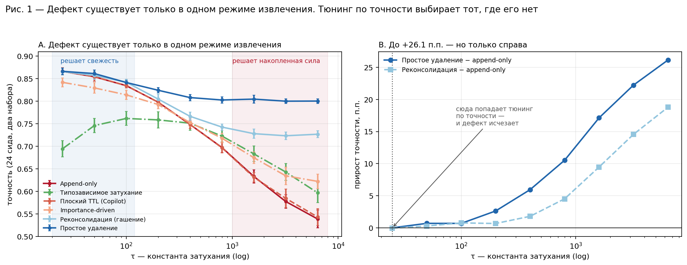

# When Does Append-Only Memory Actually Hurt?

A controlled study of correction relapse in LLM-agent memory: why an agent goes
back to a fact you already corrected, and what actually fixes it.

**Headline:** the defect is real and large — up to **26.1 percentage points** —
but only under strength-dominated retrieval. Under recency-dominated retrieval
it does not exist at all. Tuning hyper-parameters for accuracy lands you in the
second regime and makes the defect invisible, which is how three earlier
versions of this study reached wrong conclusions.

> **Status:** simulation under an assumed `strength × exp(-age/τ)` retrieval
> model. Not benchmark validation. Every claim is re-tested on two disjoint
> seed sets and across the τ spectrum; run `python3 audit.py` (claims) and `python3 robustness.py` (world variations) to check them.

---

## The mechanism

Memory is multi-trace: `fact_id → [trace(value, time, strength)]`, retrieved by
`strength × exp(-age/τ)`. Strength grows each time a value is re-asserted, so a
frequently repeated fact accumulates strength.

When a user corrects a fact, an append-only system **writes a new entry and
leaves the old trace intact**, with all its accumulated strength. At the next
retrieval the two compete. If τ is large — if ranking is driven by strength
rather than recency — the old trace wins, and the correction silently fails.

τ is the knob that decides which regime you are in. Real stores rank by
embedding similarity, edge weight or salience score, all of which are
strength-like; pure recency ranking is rare. So the regime where this matters
is the one deployed systems plausibly live in — though see Limitations.

## Results



Accuracy across the τ spectrum, 24 seeds (two disjoint sets of 12):

| Policy | τ=25 (recency) | τ=400 | τ=6400 (strength) |
|---|---|---|---|
| Append-only | 0.866 | 0.749 | 0.539 |
| Flat TTL (Copilot-style) | 0.866 | 0.749 | 0.543 |
| Importance-driven (TiM/MemTool) | 0.842 | 0.753 | 0.622 |
| Type-conditional decay | 0.695 | 0.751 | 0.597 |
| Reconsolidation (graded suppression) | 0.866 | 0.767 | 0.727 |
| **Plain deletion of the stale trace** | 0.866 | **0.808** | **0.800** |

### Five claims, each passing on both seed sets

**1. Append-only is a large defect, but only in one regime.**
τ=6400: 0.539 vs 0.800, a gap of
+26.1 pp. τ=25: 0.866 vs
0.866, no gap at all.

**2. Graded suppression works; plain deletion works better.**
Reconsolidation recovers +18.8 pp
over append-only at τ=6400, so the mechanism is real. But simply deleting the
stale trace beats it by 7.3 pp
while storing 9.4× fewer traces. A sweep over noisy corrections (to 40% wrong)
and reverting facts (to 90%) found no regime where suppression wins: max
advantage **+0.0018**, inside noise.

**3. Suppressing the stale trace does the work; boosting the corrected one does
almost nothing.** Retention 0.500 vs 0.079 at τ=6400. If you implement one thing, implement
removal, not reinforcement.

**4. The confidence paradox.** The more often a fact has been repeated, the
harder it is to correct — at every τ tested. Repetition builds strength, and
strength is exactly what defeats a correction. The entries an agent is most
confident about are its most stubborn ones.

**5. Flat TTL does nothing.** Copilot-style age-based deletion tracks
append-only within noise at every τ (+0.4 pp at
τ=6400). The stale trace that wins retrieval is precisely the one mentioned
often enough never to expire.

### Type-conditional decay: regime-dependent, not harmful

Earlier versions called this harmful. At matched τ it is better in the strength
regime (0.597 vs 0.539 at τ=6400) and
much worse in the recency regime (0.695 vs 0.866
at τ=25). See [ERRATA.md](ERRATA.md).

## The methodological result

Three of the four errors corrected in this project share one cause: **a policy
was measured at the operating point that flattered it, and its competitor at a
different one.**

> A tuned single-point comparison cannot show that a failure mode is
> unimportant, because the tuner may have selected the operating point where
> that failure mode is absent.

Accuracy-tuning drives τ to the smallest value in the grid — the recency regime,
where a stale strong trace cannot outcompete a correction *by construction*. The
tuner does not fix the defect; it leaves the regime where the defect exists and
reports it gone. The protocol is textbook-correct and answers a different
question than the one being asked.

## Practical takeaway

Make the update operation actually **remove** the stale entry. That is the whole
effect. Do not expect age-based TTL to help. Do not add graded suppression on
top — it costs storage and loses to deletion.

## Reproduce

```bash
pip install -r requirements.txt
python3 audit.py          # ~5 min: every claim, both seed sets, PASS/FAIL
python3 regime_sweep.py   # ~2.5 min, writes regimes.json
python3 regime_plot.py    # fig1_regimes.png
python3 robustness.py     # ~4 min: ordering holds across 8 world structures
python3 retention_sweep.py # ~3 min: writes retention.json (behind ERRATA E1)
```

CPU only, no GPU, no API keys.

## What this becomes with real resources

Everything here runs on a CPU in minutes because the retrieval model is a
closed-form `strength × exp(-age/τ)`. That is also the single biggest
limitation: τ is assumed, not measured. Three extensions would turn this from a
clean toy result into a real one, and each needs infrastructure this project
did not have:

1. **Measure τ on real memory systems.** Instrument Mem0, Zep and a graph store:
   write a fact, reinforce it k times, correct it once, find the k at which the
   correction stops winning retrieval. That k *is* τ, empirically. This needs a
   running deployment of each system and an LLM API budget for the extraction
   pipeline — the thing that decides whether any of this matters in practice.
   It is a few hundred dollars of API and an engineer-week, not a research
   program, but it is exactly what an individual with no compute cannot do
   cleanly.

2. **Replace the closed-form store with a real embedding retriever.** The
   `strength × recency` model is a stand-in for cosine-similarity ranking over
   learned embeddings. Rerunning every claim against an actual vector index
   (FAISS + a sentence encoder, tens of millions of stored traces) would test
   whether the recency↔strength spectrum is the right axis at all, or an
   artifact of the closed form. This is a GPU-and-storage job.

3. **Close the loop with a learned write/erase policy.** The strongest version
   of the practical result — "make the update operation actually remove the
   stale trace" — is a fixed rule. The open question is whether an RL-trained
   policy that decides *per fact* whether to delete, suppress or keep beats the
   fixed rule, and whether the confidence paradox can be exploited as a training
   signal (correct the high-strength facts harder). This is a full training run:
   many GPUs, a real agent benchmark in the loop, weeks of iteration.

None of the three is beyond a lab; all three are beyond a first-year student on
a laptop. That gap is the honest reason this stays a simulation.

## Limitations

- Simulation. The retrieval model is assumed, not measured against a real store.
- **τ is a knob in this model, not a measured property of anything.** The claim
  that real systems sit in the strength-dominated regime is an argument from how
  vector and graph stores rank, not evidence.
- Fact types are three coarse buckets with a synthetic 85% classifier.
- Literature review was targeted, not systematic.

## Next step — the experiment that would settle this

Write a fact to Mem0 and to a graph store, reinforce it k times, correct it
once, and find the k at which the correction stops winning retrieval. That k is
τ, measured. Every claim here is conditional on it, and I have not found anyone
who has measured it.

## Honest bottom line

What this project actually delivered, stated plainly:

- **A concrete, testable claim about a real failure:** correction relapse is
  caused by append-only update semantics, and it appears only under
  strength-dominated retrieval — the regime real vector and graph stores plausibly
  occupy. The fix is to make updates delete, not append. This is falsifiable and
  cheap to check on a real system (see extension 1 above).
- **One reusable methodological result:** a hyper-parameter-tuned single-point
  comparison can hide a failure mode by selecting the operating point where it is
  absent. Three of this project's own five errors were exactly that mistake. This
  generalises well beyond memory.
- **A negative result reached honestly:** the biologically motivated mechanism I
  set out to propose (reconsolidation / graded suppression) is real but strictly
  dominated by trivial deletion, shown across world structures and across the
  suppression coefficient. Reporting it as refuted, with the audit trail, is the
  point — not a failure of the project.

What makes it worth reading is not a state-of-the-art number. It is that every
claim is executable (`audit.py`, `robustness.py`), every retracted claim is
documented with its cause (`ERRATA.md`), and the one durable lesson is about how
to evaluate mechanisms, not about memory specifically. It is a small, honest,
fully reproducible result with a clear and affordable path to becoming a large
one.

## Related work

Nader, Schafe & LeDoux (2000) — reconsolidation · Moscovitch & Gilboa;
Winocur & Moscovitch — Trace Transformation Hypothesis · Hu et al.,
MemoryAgentBench, ICLR 2026 (arXiv:2507.05257) · Pulipaka et al., PersistBench
(arXiv:2602.01146) · Chhikara et al., Mem0 (arXiv:2504.19413) · Xu et al.,
A-MEM (arXiv:2502.12110) · GitHub Copilot Memory documentation ·
[MemoryAgentBench issue #18](https://github.com/HUST-AI-HYZ/MemoryAgentBench/issues/18) —
third-party GPT-4.1-mini run referenced in ERRATA

## License

MIT
